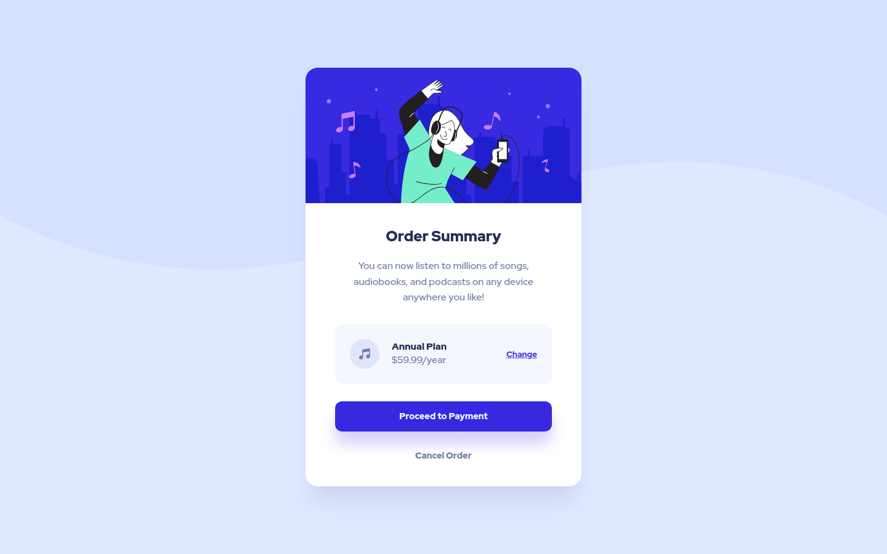

# Frontend Mentor - Order summary card solution

This is a solution to the [Order summary card challenge on Frontend Mentor](https://www.frontendmentor.io/challenges/order-summary-component-QlPmajDUj). Frontend Mentor challenges help you improve your coding skills by building realistic projects. 

## Table of contents

- [Overview](#overview)
  - [The challenge](#the-challenge)
  - [Screenshot](#screenshot)
  - [Links](#links)
- [My process](#my-process)
  - [Built with](#built-with)
  - [What I learned](#what-i-learned)
  - [Continued development](#continued-development)
  - [Useful resources](#useful-resources)
- [Author](#author)
- [Acknowledgments](#acknowledgments)

## Overview

### The challenge

Users should be able to:

- See hover states for interactive elements

### Screenshots

### Links

- Solution URL: [https://www.frontendmentor.io/solutions/order-summary-component-using-css-flexbox-1pMwz-rAp](https://www.frontendmentor.io/solutions/order-summary-component-using-css-flexbox-1pMwz-rAp)
- Live Site URL: [https://joshjavier.github.io/order-summary-component/](https://joshjavier.github.io/order-summary-component/)

## My process

### Built with

- Semantic HTML5 markup
- CSS custom properties
- Flexbox
- Mobile-first workflow

### What I learned

This project helped me practice making responsive layouts with a mobile-first workflow.

I learned about **semantics** and **accessibility**, like making sure to use the right tags based on functionality (e.g. `button` for *actions* and `a` for *navigating* to a different page) and adding landmarks for accessibility.

### Continued development

I plan to continue learning about accessibility, especially ARIA attributes and how I can use them to make my pages accessible. I also think there's room for improvement on how I write CSS, so I plan to look into resources on this.

### Useful resources

- [Cards](https://inclusive-components.design/cards/) - A great article that helped me gain a better understanding of how to structure an inclusive card component. I really like how the author talks about his thought process, considering how the markup would appear to screen readers and keyboard users.

- [CSS Inheritance, The Cascade And Global Scope: Your New Old Worst Best Friends](https://www.smashingmagazine.com/2016/11/css-inheritance-cascade-global-scope-new-old-worst-best-friends/) - This article talks about CSS inheritance and the cascade and how to leverage them when writing CSS. I still haven't developed a "style" of writing CSS, but I prefer this approach over more popular CSS frameworks.

## Author

- Website - [Josh Javier](https://joshjavier.com/)
- Frontend Mentor - [@joshjavier](https://www.frontendmentor.io/profile/joshjavier)
- Twitter - [@joshjavierr](https://www.twitter.com/joshjavierr)
- Codepen - [@joshjavier](https://codepen.io/joshjavier/)
## Acknowledgments

Thanks to [Grace Snow](https://github.com/grace-snow) for giving feedback on best practices and how to make my solution more accessible.
